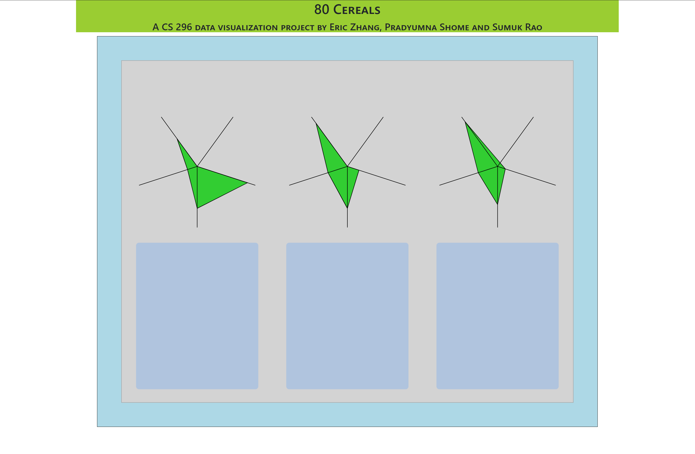

# cs-296-25-final-project

Final project for CS 296-25 Spring 2019.

## About the project

The idea is that we compare 3 cereals at a time, that users can choose via a multi-select dropdown.

For each cereal, we compare the following characteristics using a weighted polygon:

- Calories
- Sugars
- Sodium
- Fiber
- Carbohydrates

### Project Members

Eric Zhang, Pradyumna Shome, and Sumuk Rao

## Dataset

[80 Cereals, from Kaggle](https://www.kaggle.com/crawford/80-cereals)

## Screenshots

